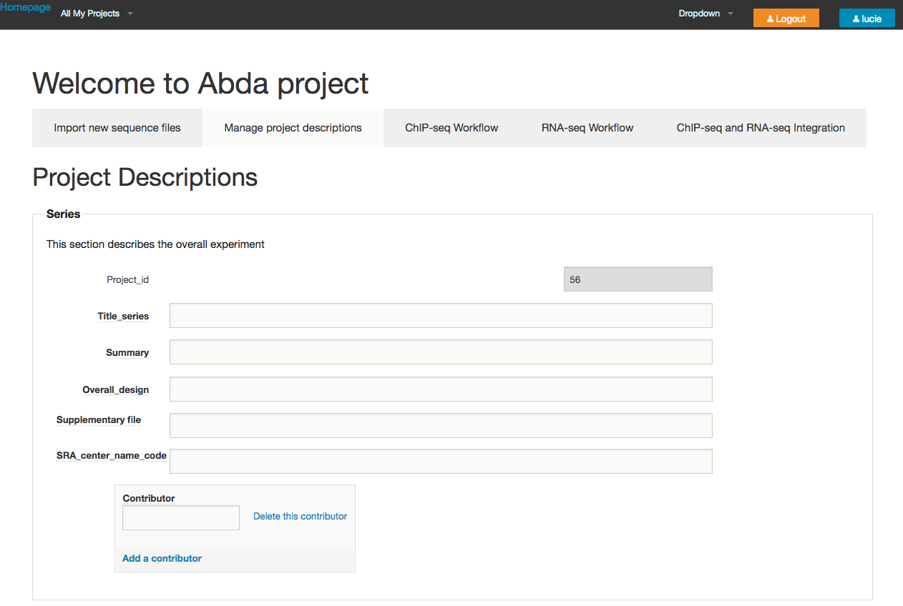
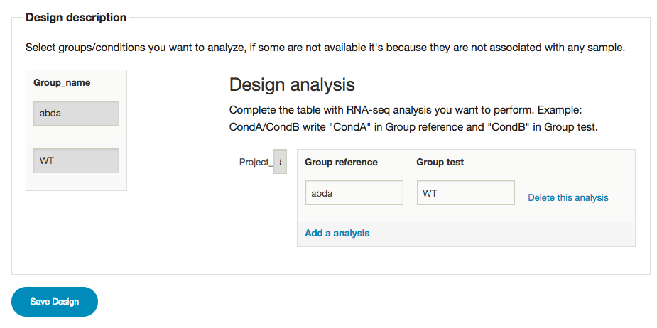

-   [Introduction](#introduction)
    -   [What is ezNGS ?](#what-is-ezngs)
    -   [Organization of the projects](#organization-of-the-projects)
-   [Quick tour](#quick-tour)
-   [Prerequisite](#prerequisite)
-   [Connecting](#connecting)
-   [Project selection](#project-selection)
-   [Data import](#data-import)
-   [Manage project description](#manage-project-description)
-   [RNA-seq Workflow](#rna-seq-workflow)
    -   [Group definitions](#group-definitions)
    -   [Sample-Group assignation](#sample-group-assignation)
    -   [Design description](#design-description)
    -   [Design the workflow](#design-the-workflow)
-   [FAQ](#faq)
    -   [I have several runs par
        sample](#i-have-several-runs-par-sample)
-   [To do](#to-do)
    -   [Interface](#interface)
        -   [All my projects](#all-my-projects)
        -   [Project access](#project-access)
        -   [Affichage des projets](#affichage-des-projets)
        -   [Import new sequence files](#import-new-sequence-files)
        -   [Manage project descriptions](#manage-project-descriptions)
        -   [Exécution des workflows](#execution-des-workflows)
        -   [RNA-seq workflows](#rna-seq-workflows)
        -   [Sample-group assignation](#sample-group-assignation-1)
        -   [Design description](#design-description-1)

Introduction
============

What is ezNGS ?
---------------

ezNGS is a Web tool designed to enable biologists to handle their Next
Generation Sequence data in a user-friendly way, and to run predefined
analysis workflows with alternative tools at different steps.

The current version supports workflows for the analysis ot the following
data types.

-   RNA-seq
-   ChIp-seq

Organization of the projects
----------------------------

-   Principle of installation, upload (admin) and utilization (user)

Quick tour
==========

???

Prerequisite
============

-   having a user account on the ezNGS server (defined by
    ezNGS administrator)
-   your data must have been transferred onto the server by the ezNGS
    admin, in your personal upload directory (data upload is currently
    not part of the user functionalities of ezNGS).
-   a project must have been created by your ezNGS admin

Connecting
==========

-   open a connection to ezNGS at <http://amidex.biotools.fr/>
-   in the topright corner, click on "Sign in" and enter our login
    and password.

After having logged in, a new menu appears in the top bar: ***All my
projects***.

Project selection
=================

-   In the top bar, click on \*\*All my projects\*.
-   This displays a list of all the projects associated to your account.

-   Clicking on a given project will open a summary of this project
    properties (identifier, creation/modification dates, granted
    users, ...).

-   After having chosen the project of interest, click on the orange
    button ***"Open project XXX"***.

**User-specific list of projects.**

This will open the Welcome page of your project.

**Project welcome page.**

Data import
===========

The **Data import** panel enables you to select, one by one, the short
read files previously deposited (by your admin) on your upload space,
and to incoroporate them in one or your projects.

In the project page, click on the tab ***Add sequence files***. This
will display the content of your upload directory. You can browse the
folders and locate the files that you want to incorporate to this
particular folder.

**Add sequence files form.**

Click on any file to select it for addition to the project. You will be
prompted to confirm your choice.

**Selection of a sequence file to be added to the project.**

**Note: ** files have to be added one by one.

Manage project description
==========================

After having added sequence files to a project, the next step is to
describe them.

Click on the tab ***Manage project descriptions*** and fill up the form.

**Project description form.**

Note that this form enables you to provide a lot of details about the
project itself, as well as about each sample. The fields of the sample
descriptiojn form were defined in concordance with the specifications
required to submit the results to the Gene Expression Omnibus database
(GEO).

<https://www.ncbi.nlm.nih.gov/geo/info/submission.html>

 **TODO:**

-   add link to the excel document
-   Button "Add a contributor" should be under
    "SRA\_center\_name\_code", rather than in the topright corner.
-   When a form is validated, the user should be redirected to the same
    form, or at least to the home page of the same project, but not to
    her/his general home page. 

In this form, we restricted the fields to those that need to be filled
in by the biologist. Other fields of the GEO submission form describe
the steps of the bioinformatics workflow. Rather than typing these
fields manually, our system **(will, in a future release)**
automatically pre-fills these fields with the tools and parameters
selected on the workflow-specific forms (ChIP-seq, RNA-seq).

It may be cumbersome to fill in all the fields before even starting the
analyses. At this stage, the only required information is the type of
each sample (ChIP-seq or RNA-seq). You will still be able to fulfill
sample annotations at any further phase of the project.

**Sample description form.**

\*\*<Notes:**>

1.  Once a sequence file has been used in a workflow, its type should
    not be changed anymore, since this would break the consistency
    between data types and analysis results. In any cases RNA-seq
    samples cannot become a ChIP-seq and reciprocally, so this is not a
    limitation, but the specification of the sample types should b done
    carefully at this very first step of the project.

2.  Each sample is defined by a unique idenfifier by using the
    [md5sum](https://en.wikipedia.org/wiki/Md5sum) procedure, which
    automatically determines a digital fingerprint for a file based on
    its content itself. No two files can have the same md5sum
    fingerprint (and thus our internal identifier) unless their content
    is absolutely identical.

RNA-seq Workflow
================

**Principle:** the RNA-seq workflow detects differentially expressed
genes (DEG) based on the classical **DESeq2** and **edgeR** procedures.

Differential analysis requires for each sample to be assigned to a given
group (e.g. culture conditions, treatment, tissue types, genotypes,
...).

Users are required to go to the following steps before running the
differential analysis:

-   defining groups (names, descriptions);
-   assigning each sample to one or several groups;
-   defining the analytic design, i.e. which pairs of groups have to be
    compared in differential analysis.

Group definitions
-----------------

**Definition of groups for differential analysis of RNA-seq data. **

Sample-Group assignation
------------------------

**Note: ** the fact to assign a same sample to several groups enables to
ru different analyses within the context of the same project (e.g. all
the wild-types versus all mutants, and then wild-type at a given stage
versus wild-type at another stage). However it requires to define
sample/group assignation in a consistent way. Indeed, if the design
involves to compare two groups, a same sample cannot belong to both
groups.

**Sample to group assignation for differential analysis of RNA-seq data.
**

Design description
------------------

The analysis design consists in defining one or several pairs of groups
that will be compared. Indeed, the RNA-seq form allows to run multiple
analyss in a single project. For example

    - in a time series, compare different time points to the starting time;
    - compare multiple treatments to the untreated samples; ... 

**Design definition. **

 TODO:

-   Sample-Group assignation: replace checkboxes by radio buttons (so
    far the snakemake workflows only support one condition per sample,
    since it is a single column of the sample.tab file). Add a "none"
    button to enable deselecting samples for the current analysis.

-   When there is an empty group, a checkbox currently appears. After
    adaptation, radio bxes should only appear for groups having a name.

-   "Complete the table with RNA-seq analysis you want to perform.
    Example: CondA/CondB write "CondA" in Group reference and "CondB" in
    Group test."

    -&gt; Indicate the groups to be compared for differential analysis.
    The left column indicates the test group (e.g. mutant, treated) and
    the right column the reference group (wild-type, untreated).
    Additional test versus reference comparisons can be done by clicking
    "Add analysis".

-   In the design box, swap Reference and Test: Test should come before
    reference (Test versus Reference).
-   Group test -&gt; Test group (e.g. mutant, treated)
-   Group reference -&gt; Reference group (e.g. wild-type, untreated)
-   "Sample To analyse" -&gt; "Summary of the analysis"
-   the "Genome" section should be moved to the project form 

Design the workflow
-------------------

-   **seq\_type**: this parameter enables to choose whether the analysis
    should be done in single-end or paired-ends mode. Note that in some
    circumstances paired-ends sequences can be analysed as if they
    were single-end.

 TODO

-   The sample import does not handle the coupling of fastq files when
    sequencing is done in paired-ends. This has to be rethought. Andy
    should look for a solution, which may require Ajax: once a sample is
    labeled as paired end, a second box must present the samples to
    select the paired fastq file. When a file is selected as paired, its
    row must disappear from the remaining samples.

-   -   "Metadata" currently contain a single parameter. This is a bit
    strange to have a section for a single parameter.

-   Genome size should be computed automatically

    `grep -v '^>' /workspace/rsat/data/genomes/Drosophila_melanogaster/genome/Drosophila_melanogaster.dna.genome.fa | perl -pe 's|\s||g' | wc -c`

-   Can we include a way to select automatically the genomes from UCSC

FAQ
===

I have several runs par sample
------------------------------

The current interface assumes that each fastq file corresponds to one
sample. If several runs have been done per sample, the run-specific
fastq files should be merged by samples before transferring the files to
the system.

To do
=====

Interface
---------

### All my projects

-   <s>All my projects: un triangle apparaît mais il n'y a rien
    en-dessous -&gt; remplacer menu drop down par un menu normal.
    Alternative: all the project would appear under the menu when
    clicking on the triangle.</s>
-   The project summary displayed on the page "All my projects" could
    include some additional fields, in particular the number of samples,
    and the short description string.

-   <s>"Go Abda" -&gt; "Open project Abda"</s>

### Project access

-   <s>L'URL d'accès à un projet ne devrait contenir que l'ID.</s>

<s><http://amidex.biotools.fr/users/projects_users/go/?id=56&name=Abda></s>

<s>devrait être:</s>

<s><http://amidex.biotools.fr/users/projects_users/go/?id=56></s>

<s>Par contre le nom de projet doit systématiquement apparaître sur le
titre de la page de projet.</s>

<s>Actuellement si l'utilisateur change le nom dans l'URL le site
affiche le nom que l'utilsateur a entré, ce qui peut provoquer des
incohérences entre le nom affihé et le nom réel. Le vrai nom de projet
(stocké dans la DB) doit être affiché, pas le nom entré dans l'URL.</s>

-   <s>Si on fournir un URL non valide, il faut afficher un message
    d'erreur "No such project" ou tout au moins une erreur 404. Par
    exemple</s>

<s><http://amidex.biotools.fr/users/projects_users/go/?id=0980></s>

<s>affiche "Welcome to project" alors qu'il n'existe pas de projet avec
cet ID.</s>

### Affichage des projets

Quand on ouvre la page d'un projet (à partir de All My Projects) il
faudrait afficher la page de description du projet. Pour le moment cette
page contiendra la même info que le résumé affiché avec "All my
Projects" mais on devrait aussi y ajouter

-   le nom de projet
-   une description du projet

En gros cela devrait ressembler à la page d'une série GEO.

### Import new sequence files

-   <s>This form should be renamed "Add sequence files"</s>

-   <s>la boîte de filtres ne fonctionne pas comme on s'y attendrait.
    Cette fonctionnalité fait partie de la classe prédéfinie php, mais
    on peut la masquer pour éviter la confusion, via le css.</s>

### Manage project descriptions

-   <s>Title\_series: vérifier si c'est bien le nom, a priori on dirait
    "Series title"</s>

-   <s>Le champ "Summary" doit être une textarea (plusieurs lignes)
    plutôt qu'une textbox (une ligne).</s>

-   <s>Overal design: textarea plutôt que textbox.</s>

-   <s>Ajouter le champ "Organism"</s>

-   <s>Supplementary file: this field should not be a textbox but an
    upload button. If this feature of GEO submissions is not really
    used, we can also suppress this field from our form.
    To evaluate.</s>
-   Les boutons "Delete sample" ne fonctionnent pas. Il faudrait évaluer
    si l'on permet à l'utilisateur d'effacer les échantillons
    d'un projet. Ceci n'est pas évident car il se peut que l'échantillon
    ait déjà été traité, et u'il y ait un tas d'autres fichiers liés
    (bam, fastqc, ...). De plus il se peut que les résultats (par
    exemple tables de comptages, résultats d'analyse différentielle)
    soient basés sur cet échantillon -&gt; en l'effaçant on casse la
    cohérence entre les données et les résultats.

-   Sample description form: once a sequence file has been used in a
    workflow, its type cannot be change anymore, since an RNA-seq cannot
    become a ChIP-seq and reciprocally.

-   Add a button "validate" after each section of the form.

### Exécution des workflows

-   il faudrait avoir une trace du statut de chaque workflow

-   il fadurait qu'on définisse une règle "Done" qui génère un fichier
    quand le workflow est fini, ce qui permettra de connaître le statut
    de chaque workflow. A voir avec Claire.

### RNA-seq workflows

-   the multiple assignation samples - groups may pose some problems of
    consistency: if in the design we compare two groups and a same
    sample belongs to the two groups the back-end (snakemake)
    should complain.

#### Group definitions

-   The addition of a new group should appear as a row at the end of the
    list of existing groups.

-   The button "Add new group" is not necessary (especially if the "Save
    new group" section comes at the end of the existing groups).

-   The fields "Group description" and "Group name" should be editable
    even during the project.

-   The function "Delete this group" est dangereuse: si le group a déjà
    été utilisé dans un workflow on casse l'intégrité entre les données
    et les résultats.

### Sample-group assignation

-   <s>Sample-Group assignation: the blue button should be inside the
    gray rectangle.</s>

### Design description

-   the groups should be selected with a drop-down menu (HTML select)
    rather than as free text, to ensure consistency between the groups
    to be compared and those defined and assigned to samples .

-   actually the design should be based on the group IDs, not
    their names. The group name is a matter of display (this is
    displayed in the menu) but the design file should contain the unique
    ID of the group. This is also necessary if one wants to allow user
    to edit the group names (which is a good thing) without detroying
    the consistency between the design, the data
    (sample/group assignations) and the results.

-   <s>The button "Save Design" should be inside the Design description
    rectangle, not below it.</s>
